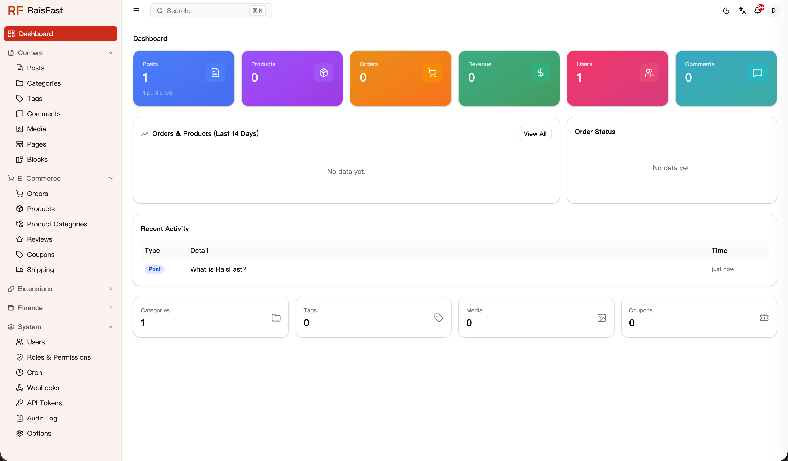

<div align="center">
  <a href="./README.md">English</a> | <a href="./README_CN.md">简体中文</a>
</div>

---

<p align="center">
  
</p>

<h1 align="center">RaisFast — The fastest CMS, easiest to deploy</h1>

<p align="center">
  <strong>The fastest CMS, easiest to deploy.</strong>
  <br />
  Rust-powered high-performance BaaS and headless CMS · Built-in blog / ecommerce / wallet / payment / workflow / multi-tenant SaaS
  <br />
  JS / Rhai / Lua / WASM plugin engines · MCP-native · Single binary · Zero GC
  <br />
  <a href="https://raisfast.com">Website</a> ·
  <a href="https://raisfast.com/docs">Docs</a> ·
  <a href="https://github.com/RaisFast/raisfast/releases">Download</a> ·
  <a href="https://github.com/RaisFast/raisfast/discussions">Discussions</a> ·
  <a href="#quick-start">Quick Start</a>
</p>

<p align="center">
  <a href="https://github.com/RaisFast/raisfast/stargazers"></a>
  <a href="https://github.com/RaisFast/raisfast/releases"></a>
  <a href="https://github.com/RaisFast/raisfast/actions/workflows/ci.yml"></a>
  <a href="https://github.com/RaisFast/raisfast"></a>
  <a href="./LICENSE"></a>
  <a href="https://github.com/RaisFast/raisfast"></a>
</p>

---

> **Early Alpha — API may change before v1.0.**
> Targeting stable v1.0 in Q3 2026.

---

<p align="center">
  <a href="https://demo.raisfast.com/admin" target="_blank">
    
  </a>
  <br />
  <em>Admin UI — <a href="https://demo.raisfast.com/admin" target="_blank">click the screenshot or here for the live demo</a></em>
</p>

---

## Why raisfast?

**Single binary, full capability**
One binary, no Node.js, no Docker, no runtime. Blog, ecommerce, wallet, and payment are native built-in — not plugin assemblies, but the skeleton itself.

**Rust performance, zero-GC stability**
Sub-millisecond reads, zero performance degradation over time. No GC pauses, no memory leaks, no 3 AM OOM alerts.

**4 plugin engines, inspired by Strapi**
JS, Rhai, Lua, and WASM — a full spectrum from scripting to compiled. Dynamic language productivity on a Rust performance foundation.

**Built for AI**
Native MCP (Model Context Protocol) server. AI clients like Claude Desktop can read/write content and invoke tools directly.

---

## What's Built-In

| Module | Features |
|--------|----------|
| **Blog / CMS** | Posts, pages, categories, tags, comments, media, RSS, sitemap |
| **Ecommerce** | Cart, orders, product variants, coupons, shipping templates |
| **Wallet & Payment** | Multi-currency wallet; Alipay / WeChat Pay / Stripe / Dodo / Creem via unified payment routing |
| **Workflow** | Workflow engine + job queue + cron scheduler + event bus |
| **Content Types** | Dynamic schema via TOML, grouping, batch ops, rule engine, auto CRUD API |
| **Auth** | JWT (HS256) + Refresh tokens + API tokens + multi-role RBAC |
| **OAuth** | GitHub / Google / WeChat and more social login |
| **MCP** | Model Context Protocol server (Streamable HTTP + stdio) for AI clients |
| **GraphQL** | Optional GraphQL API (async-graphql) |
| **Webhook** | Event-driven webhook delivery |
| **Notifier** | Email (SMTP) / SMS notifications |
| **Multi-tenant** | Optional tenant isolation + built-in reverse proxy for SaaS |
| **Plugin Engine** | JS (QuickJS) / Rhai / Lua (mlua) / WASM (wasmtime), VFS, hot reload |
| **Search** | Full-text search (Tantivy) |
| **Admin UI** | React 19 + shadcn/ui dashboard (embedded in binary) |
| **Desktop** | Tauri cross-platform desktop app |
| **Tunnel** | Built-in tunnel client — expose local ports to the internet |
| **Multi-DB** | SQLite / PostgreSQL / MySQL — zero code changes |
| **Observability** | Structured logging, Prometheus metrics, request ID, audit log, panic webhook |

---

## Quick Start

### One-line install

```bash
# SQLite (default — zero config)
curl -fsSL https://raw.githubusercontent.com/RaisFast/raisfast/main/scripts/install.sh | sh

# PostgreSQL
curl -fsSL https://raw.githubusercontent.com/RaisFast/raisfast/main/scripts/install.sh | sh -s -- postgres

# MySQL
curl -fsSL https://raw.githubusercontent.com/RaisFast/raisfast/main/scripts/install.sh | sh -s -- mysql
```

This downloads the latest prebuilt binary to `~/.local/bin/raisfast`.

```bash
# Start the server
raisfast

# Server starts at http://localhost:9898
# Admin UI at  /admin
# Swagger at   /swagger-ui
# Health at    /api/v1/healthz
```

### Build from source

```bash
# Clone
git clone https://github.com/RaisFast/raisfast.git
cd raisfast

# Prepare config (edit .env as needed)
cp .env.example .env

# Build and run (default features: SQLite + search + JS/Lua/Rhai + OpenAPI + Proxy + Tunnel + MCP)
cargo run

# Server starts at http://localhost:9898
# Admin UI at  /admin
# Swagger at   /swagger-ui
# Health at    /api/v1/healthz
```

> Want everything (adds WASM engine, payments, S3 storage)?
> ```bash
> cargo run --features "plugin-wasm payment-all storage-s3"
> ```

### First run

On first startup, raisfast automatically:
1. Creates all database tables (embeds `SCHEMA_SQL`)
2. Seeds default roles, permissions, and site options
3. Starts serving API + Admin UI

Create an admin user (CLI subcommand):

```bash
cargo run -- user create --email admin@example.com --username admin --password your-password --role admin
```

### Using `just` (recommended workflow)

The repo ships a `justfile` wrapping common build / test / DB commands:

```bash
just dev          # dev with live SQL compile-time validation
just build        # release build
just qa           # fmt check + clippy
just test         # run all tests
just db-init      # create DB and load schema
just db-migrate   # run migrations
```

Switch backend with one env var: `RAISFAST_DB=postgres just test` (default `postgres`; also `sqlite` / `mysql`).

### Docker

Single container (SQLite local storage):

```bash
docker build -t raisfast .
docker run -p 9898:9898 -v ./data:/app/data raisfast
```

Full stack (`docker-compose.yml`, with RustFS / S3-compatible storage):

```bash
docker compose up -d
# backend  → http://localhost:9898
# frontend → http://localhost:3000
# rustfs (S3) → http://localhost:9001
```

---

## Architecture

raisfast is a Cargo workspace:

```
raisfast/
├── crates/
│   ├── core/           # main crate (raisfast): business & services
│   └── derive/         # proc-macro crate (raisfast-derive): CRUD / Where DSL
├── frontend/
│   ├── admin/          # React + shadcn admin UI (build output embedded in binary)
│   ├── sdk/            # official TypeScript SDK
│   ├── registry/       # plugin / content-type registry (Cloudflare Workers)
│   ├── templates/      # starters (blog / ecommerce / payment, etc.)
│   └── raisfast.com/   # marketing & docs site
├── migrations/         # three schemas (sqlite / postgres / mysql)
├── extensions/         # built-in examples: content_types/ + plugins/
├── plugin-sdk/         # plugin SDK (JS / Lua types & helpers)
├── plugin-wit/         # WASM component interface (.wit)
├── adminui/            # prebuilt admin UI assets (embedded via rust-embed)
├── templates/          # app / plugin / email / codegen templates
├── locales/            # i18n (en / zh-CN)
├── deploy/             # Fly.io / Vercel deploy configs
└── docs/ · dev-docs/   # architecture docs / design notes
```

`crates/core/src/` module overview:

```
src/
├── main.rs · lib.rs · app.rs     # entry + AppState composition
├── server/                       # HTTP server + route registration + OpenAPI
├── cli/                          # subcommands (server/db/user/ct/plugin/...)
├── handlers/                     # route handlers (thin: extract → service → respond)
├── services/                     # business logic (ownership / Policy checks)
├── models/                       # data structures + SQL queries (sqlx + CRUD macros)
├── dto/                          # data transfer objects
├── commands/                     # CQRS command handlers
├── middleware/                   # auth / rate limit / CORS / tenant / metrics / security headers
├── plugins/                      # 4-engine plugin system (JS/Rhai/Lua/WASM) + VFS
├── content_type/                 # dynamic content types + rule engine + import/export
├── payment/                      # payment providers + routing + crypto
├── workflow/                     # workflow engine
├── worker/                       # job queue + cron scheduler
├── graphql/                      # GraphQL API
├── mcp/                          # MCP (Model Context Protocol) server
├── proxy/                        # multi-tenant reverse proxy
├── tauri/                        # Tauri desktop integration
├── oauth/                        # OAuth providers
├── notifier/                     # email / SMS notifications
├── event/ · eventbus.rs          # event bus
├── webhook/                      # webhook system
├── audit.rs · cache.rs           # audit log / cache (moka)
├── protocols/                    # AOP protocols (ownable / tenantable / timestampable …)
├── db/                           # connection pool / dialect / schema / multi-tenant / write lock
├── storage/                      # file storage (local / S3)
├── search/                       # full-text search (Tantivy)
├── config/                       # env-based configuration
├── errors/                       # unified AppError (thiserror)
├── types/ · utils/               # shared types / helpers
└── admin_spa.rs                  # embedded admin UI (rust-embed)
```

### Layering

```
Handler → Service → Model (SQL)
                ↘ External: Storage / Cache / Search / EventBus / Webhook
```

- **Handlers** contain no business logic; they are the only auth entry point (`ensure_*`)
- **Services** orchestrate models and external services; they only do resource ownership checks (Policy)
- **Models** hold only data structures and SQL queries, with `tx_*` variants for transactions

---

## CLI

raisfast ships a full command-line (clap):

```bash
raisfast                               # same as: raisfast server start
raisfast server start|stop|restart|status
raisfast db migrate|rollback|backup
raisfast user create|list|passwd|delete|disable|enable
raisfast ct new|check|types            # content-type mgmt + TS type generation
raisfast plugin new|check              # plugin scaffolding + validation
raisfast codegen model                 # scaffold models from schema.sql
raisfast route ...                     # route inspection
raisfast doctor                        # system diagnostics
raisfast mcp serve                     # run MCP server over stdio (for Claude Desktop, etc.)
raisfast proxy start|check             # multi-tenant reverse proxy
raisfast tunnel <local-port>           # expose a local port to the internet
```

---

## Switching Databases

Zero code changes — just change the feature flag:

```bash
# SQLite (default)
cargo build --no-default-features --features "db-sqlite"

# PostgreSQL
cargo build --no-default-features --features "db-postgres"

# MySQL
cargo build --no-default-features --features "db-mysql"
```

> **Note:** `BIGINT PRIMARY KEY` does not auto-increment on PostgreSQL/MySQL, and sqlx proc-macros need a live database at compile time. See [`AGENTS.md`](AGENTS.md) for "Postgres first-run" and cross-DB development rules.

---

## Feature Flags

```bash
# Database backend (pick one; default db-sqlite)
--features "db-sqlite | db-postgres | db-mysql"

# Plugin runtimes (plugin-js / plugin-lua / plugin-rhai are on by default)
--features "plugin-all"          # adds the WASM engine
--features "plugin-wasm"         # WASM only

# Payments (off by default)
--features "payment-all"         # Alipay + WeChat + Stripe + Dodo + Creem
--features "payment-stripe"      # or pick individually

# Other optional capabilities
--features "storage-s3"          # S3 / RustFS object storage
--features "tls"                 # built-in HTTPS (rustls)
--features "cron-system"         # system shell-script cron
--features "tauri"               # Tauri desktop mode
--features "export-types"        # export TypeScript types (ts-rs)
```

**Defaults on:** `db-sqlite`, `search-tantivy`, `plugin-js`, `plugin-lua`, `plugin-rhai`, `openapi`, `proxy`, `tunnel`, `mcp`

---

## Plugin System

```
extensions/plugins/
└── my-plugin/
    ├── plugin.toml      # manifest
    ├── main.js          # JavaScript (QuickJS)
    ├── main.lua         # Lua (mlua)
    ├── main.rhai        # Rhai
    └── main.wasm        # WASM (wasmtime, conforms to plugin-wit/plugin.wit)
```

Example `plugin.toml`:

```toml
[plugin]
name = "my-plugin"
version = "0.1.0"
entry = "main.js"

[permissions]
http = ["GET"]
db = ["read"]
hooks = ["post_created", "comment_created"]
```

- **Plugin SDK:** `plugin-sdk/` provides JS / Lua types and helpers; WASM plugins conform to the `plugin-wit/plugin.wit` contract.
- **Virtual filesystem:** each plugin gets an isolated VFS (tunable via `PLUGIN_VFS_*` quotas).
- **Examples:** `extensions/` ships sample plugins (crm, forum, seo-rhai) and content types you can study.

---

## Configuration

All configuration is via environment variables or `.env` (see `.env.example` for the full list):

```bash
# ── Server ──────────────────────────────
APP_HOST=0.0.0.0
APP_PORT=9898                       # default 9898
APP_ENV=development                 # development | production
APP_TIMEZONE=UTC                    # IANA, e.g. Asia/Shanghai
# APP_KEY=                           # auto-generated on first start (AES-GCM)
# CORS_ORIGINS=https://your.domain   # comma-separated
# BASE_URL=http://localhost:9898     # public URL (for RSS / media links)

# ── Database ────────────────────────────
DATABASE_URL=sqlite:./storage/db/raisfast.db?mode=rwc
# DB_POOL_SIZE=5
# STORAGE_ROOT_DIR=./storage         # local root (uploads/logs/search_index/vfs/db)

# ── Auth ────────────────────────────────
JWT_SECRET=change-me-in-production-at-least-32-chars
JWT_ACCESS_EXPIRES=900               # 15 minutes
JWT_REFRESH_EXPIRES=604800           # 7 days

# ── Storage ─────────────────────────────
# STORAGE_DRIVER=local               # local | s3
# MAX_UPLOAD_SIZE=104857600
# S3_ENDPOINT=http://rustfs:9000     # only when STORAGE_DRIVER=s3
# S3_ACCESS_KEY= · S3_SECRET_KEY= · S3_BUCKET= · S3_REGION= · S3_PUBLIC_URL=

# ── Plugins ─────────────────────────────
# PLUGIN_DIR=./extensions/plugins
# PLUGIN_VFS_ROOT= · PLUGIN_VFS_MAX_FILE_SIZE= · PLUGIN_VFS_MAX_TOTAL_SIZE=
# PLUGIN_WASM_POOL_SIZE=4 · PLUGIN_LUA_POOL_SIZE=4 · PLUGIN_JS_POOL_SIZE=4

# ── Worker / Cron ───────────────────────
# WORKER_ENABLED=false · WORKER_CONCURRENCY=2
# CRON_SEED_ENABLED=false · CRON_LOG_RETENTION_DAYS=30
# CRON_SCHEDULES=[{"label":"...","job_type":"...","cron_expr":"...","enabled":true}]

# ── API toggles ─────────────────────────
# GRAPHQL_ENABLED=true               # /api/v1/graphql
# WEBSOCKET_ENABLED=true             # /api/v1/ws

# ── Built-in modules ────────────────────
# BUILTIN_BLOG=true · BUILTIN_PAGES=true · BUILTIN_MEDIA=true
# BUILTIN_FULLTEXT=true · BUILTIN_WORKFLOW=true · BUILTIN_TENANTABLE=false

# ── Rate limit (max_requests/window_secs)
# RATE_LIMIT_GLOBAL_MAX=60 · RATE_LIMIT_LOGIN_MAX=10 ...
```

---

## Deployment

| Platform | How |
|----------|-----|
| **Docker** | `docker build` or `docker compose up` (with RustFS) |
| **Fly.io** | `just deploy-fly` (config in `deploy/fly/`) |
| **Vercel** | script `deploy/vercel.sh` |
| **Bare metal / binary** | `cargo build --release`, single-file distribution |

---

## Tech Stack

| Layer | Technology |
|-------|-----------|
| Language | Rust (edition 2024) |
| HTTP Framework | Axum 0.8 |
| Database | SQLx 0.9 (SQLite / PostgreSQL / MySQL) |
| GraphQL | async-graphql 7 |
| Auth | JWT (HS256) + Argon2 |
| Cache | moka |
| Search | Tantivy 0.26 |
| Plugin Runtime | wasmtime / rquickjs / mlua / rhai |
| ID generation | ferroid (Snowflake + multiplicative inverse cipher + base62) |
| Email / Templating | lettre / Tera / Comrak (Markdown) |
| Admin UI | React 19 + Vite + shadcn/ui (Base UI) |
| Desktop | Tauri 2 |
| Object storage | AWS SDK for S3 / RustFS |
| Embedded assets | rust-embed |

---

## Project Status

| Component | Status |
|-----------|--------|
| Core API + Admin UI | ✅ Working |
| Auth (JWT + OAuth + API Token + RBAC) | ✅ Working |
| Multi-database (SQLite / PG / MySQL) | ✅ Working |
| Plugin engine (JS / Rhai / Lua / WASM) | ✅ Working |
| Content Type system (+ rule engine) | ✅ Working |
| Ecommerce (cart / orders / shipping templates) | ✅ Working |
| Wallet + unified payment routing | ✅ Working |
| Workflow engine | ✅ Working |
| Job queue + Cron | ✅ Working |
| MCP server | ✅ Working |
| GraphQL API | ✅ Working |
| Webhook + Notifier | ✅ Working |
| Multi-tenant + reverse proxy | ✅ Working |
| Tunnel | ✅ Working |
| Tauri desktop | 🔧 In development |
| Plugin marketplace | 📋 Planned |

---

## License

Licensed under [Apache License 2.0](LICENSE).

---

## Contributing

We welcome contributions! Please read [CONTRIBUTING.md](CONTRIBUTING.md) and [AGENTS.md](AGENTS.md) (architecture constraints and cross-DB development rules) for details.

---

<p align="center">
  Built with ❤️ and Rust
</p>
